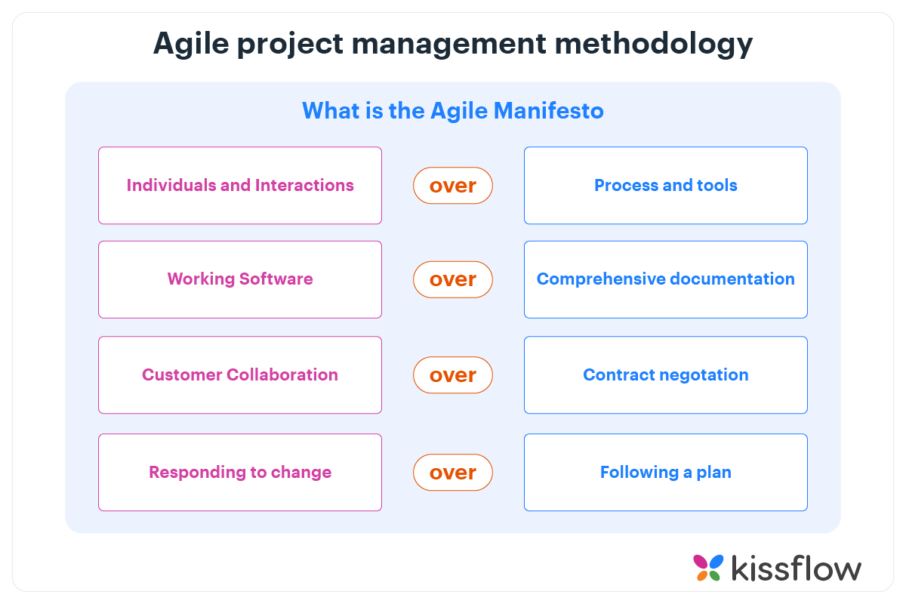
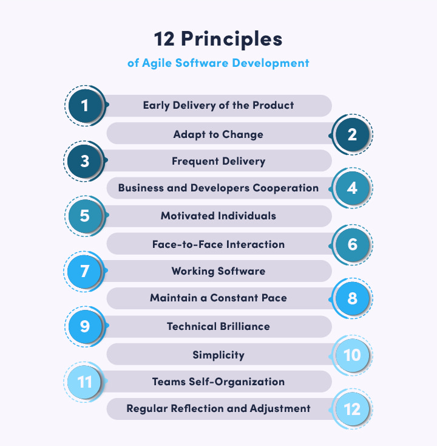
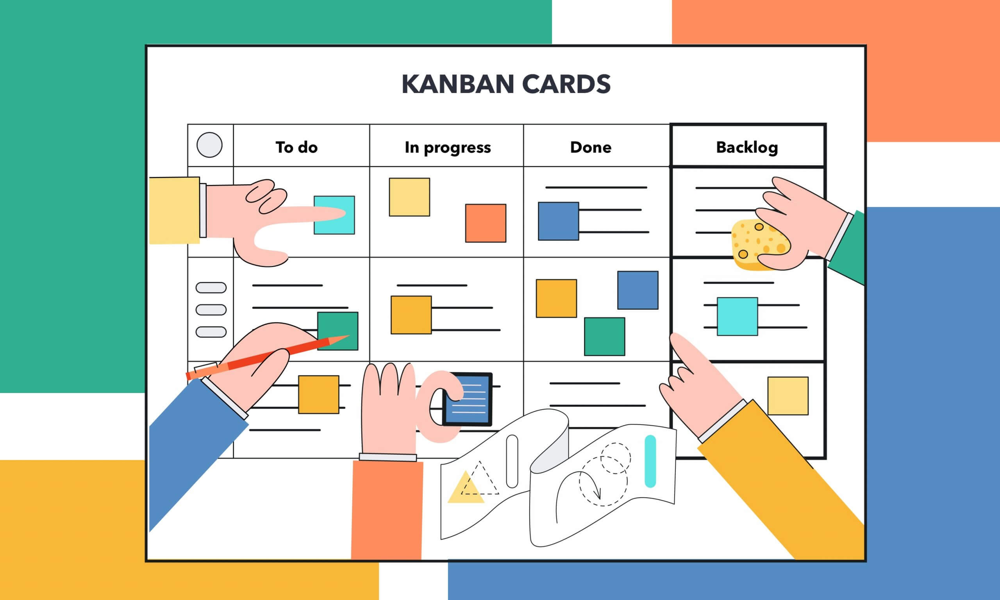
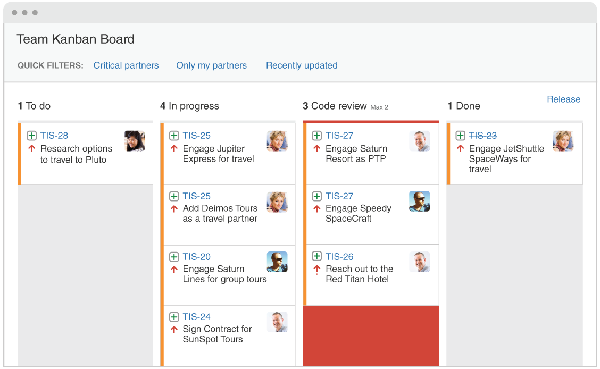
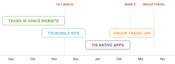
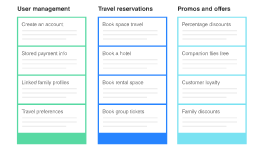

# Agile

## 우리는 팀!

---

# Agile 이 뭐지?

`효과적이고 민첩한 팀의 작업을 위한 몇 가지 가치와 원칙의 집합`

- Waterfall <-> Agile

---

# Agile Manifesto

현대 project management 의 방법론의 근간이 된 문서

---

# Agile 4 values

---

# Agile 12 principles

---

# Agile Frameworks

## Scrm

## Kanban

---

# Scrum

---

# Sprint

`정해진 양 만큼의 일을 정해진 기한 안에 완수하도록 정해진 기간. scrum 의 핵심`

---

# 4 ceremonies

- Sprint planning
- Daily Scrum (Stands up)
- Sprint Review
- Sprint Retrospective

> ceremonies 는 팀 간에 소통을 가능하게 할 뿐 Agile 을 완성시켜주지 않는다. 협업과 문화, 끊임없는 개선과 의사소통, 협업을 통해 Agile 은 완성되어간다.

---

# Sprint planning

`스프린트에 적합한 작업 항목을 팀원들이 함께 결정하고, 어떻게 이루어낼 것인지를 계획하는 작업. 작업 항목, plan 들은 모두 backlog 로 만들어진다`

- "이 스프린트에서 어떤 작업을 수행할 수 있을까?
- "선택한 작업은 어떻게 완료할 수 있을까?"

> 모든 팀원이 스프린트 목표와 성공을 측정하는 방법을 설정하고 이해하도록 해야함.
> 세부사항(구현 상세)에 집중하기보다 sprint 의 목표에 초점을 두는 것이 좋다

---

# Daily Scrum

`Sprint 기간 중 작업이 어떻게 진행되고 있는지 체크하기 위한 모임. 가능한 짧게 한다`

- What did I complete yesterday?
- What will I work on today?
- Am I blocked by anything?

> 스프린트 목표를 달성하는 팀의 능력에 영향을 주는 방해요소나 도전 과제를 파악하는 것. 그리고 작업량이 적절한지 회고하고 realign 할 수 있는 시간도 된다.

---

# Sprint Review

` 팀이 모여서 공식, 비공식적인 작업의 결과물에 대한 데모(시연)를 진행하는 것. 이 시간을 통해서 직접 경험, 피드백, 질문 등을 할 수 있다.`

적대적이고 평가적인 모임이 아니라 각자 팀의 결과물을 공유함으로써 피드백을 얻고 질문 받을 수 있는 시간이며, 오히려 팀의 사기 진작을 위한 시간이 될 수도 있다. 노동의 결과를 마음껏 즐기는 시간이 되길!

> 결과물을 공유하는 것은 Agile 팀을 구성하는데 중요한 요소 중 하나이다

---

# Sprint Retrospective

`다음 스프린트 및 앞으로 개선할 점 등을 함께 논의해보는 시간`

> Agile 은 빠른 피드백과 지속적인 interaction 과 improvement 를 통해 발전해나간다.

---

# Kanban

> 작업 사항들은 kaban board 로 표현되고, 해당 작업 사항들의 상태를 팀원들이 실시간으로 언제나 볼 수 있다.

---

# Kanban

- 역량에 대한 실시간 커뮤니케이션과 완전한 투명성을 요구함.
- commitment point 에서 delivery point 로의 시간을 줄이는데 초점을 맞춘다.
- 끊임없는 선형적인 workflow

---

# WIP Limit

`개인의 WIP 상태 작업 갯수를 제한하는 것.`

---

# WIP Limit

- 작은 단위의 일에 집중할 수 있음
- blocking issue 및 bottle neck 발생 원인을 쉽게 찾을 수 있음

> 일단 작업을 진행하려는 유혹을 뿌리칠 수 있도록 팀원들에게 WIP limits 을 하는 가치, 이유를 공유하는 것이 좋다.

---

# important!

- 개인의 작업량을 일관적으로 관리하도록 한다. 하나의 task 가 16 시간을 넘지 않도록 작업을 쪼개는 것이 좋다
- 지속 가능한 개발 문화를 만드는 것이 중요
  - 내가 bottle neck 이 되지 않는 것이 중요하다! (휴가 맘 편히 가고 싶으면 공유해라) => code review, pair programming 등
  - WIP limits 가 작업을 빨리 끝내고 빈둥거릴 수 있는 이유가 되지 않도록 한다
- CI / CD (한번에 하나씩 고객들에게 지속적으로 가치 전달!)

---

# Kanban 장점

- 유연한 작업 계획, 그리고 빠르고 명확하게, 집중적으로 처리할 수 있도록 도와줌.
- time cycle 단축에 목표를 두기에 빠르고 주기적인 release.
- bottle neck 파악 및 제거에 용이.

---

# Scrum vs Kanban

| 제목                | 내용                                                                                                                                | 설명                                                             |
| ------------------- | ----------------------------------------------------------------------------------------------------------------------------------- | ---------------------------------------------------------------- |
| Cadence             | Regular fixed length sprints (ie, 2 weeks)                                                                                          | Continuous flow                                                  |
| Release methodology | At the end of each sprint if approved by the product owner                                                                          | Continuous delivery or at the team's discretion                  |
| Roles               | Product owner, scrum master, development team                                                                                       | No existing roles. Some teams enlist the help of an agile coach. |
| Key metrics         | Velocity                                                                                                                            | Cycle time                                                       |
| Change philosophy   | Teams should strive to not make changes to the sprint forecast during the sprint. Doing so compromises learnings around estimation. | Change can happen at any time                                    |

---

# Scrum 에서도 kaban board 사용하던데?

- scrum 은 sprint 라는 주기가 있어서 start, end 가 정해져있음.
- role 이 명확히 구분됨
- 프로젝트 전체 수명주기 vs sprint 주기 (끝나면 싹 비워지거나 옮겨짐. recycle!)
- sprint 는 좀 더 estimate 에 초점을 맞추고, kaban 은 언제나 우선순위를 재정렬하고 작업 담당이 바뀔 수 있고, 수정될 수 있음.

---

# backlogs

`Roadmap 과 Requirements 로부터 파생된 (우선순위가 정리된) 작업의 리스트`

우선순의는 다음의 4가지를 통해서 설정

- Customer priority
- Urgency of getting feedback
- Relative implementation difficulty
- Symbiotic relationships between work items (e.g. B is easier if we do A first)

---

# example

|                                  |                                  |
| -------------------------------- | -------------------------------- |
|  |  |

---

### stories

`As a [persona], I [want to], [so that]` => 어떤 가치를 제공할 것인지에 집중.
1~2 주 내 작업을 완료할 수 있는 것.

### epics

작은 단위(stories)로 나눌 수 있는 큰 틀 (ex - review 등록율을 늘려보자)

### initiatives

목표를 위한 epic 의 집합 (ex - user input data 량을 100% 늘려보자)

### theme

조직 전체가 바라보는 큰 관점 (ex- 데이터와 사람들을 연결하자)

---

# Estimation

`Agile Estimation 은 추정이다! 피의 맹약 같은 것이 아니다.`

Product Owner 가 더 좋은 제품을 구상하고 개발할 수 있도록 효율성 및 영향력을 높이는데 도움이 된다. 그리고 팀이 우선순위를 정하는데 도움이 되기도 한다.

---

# story point

전통적인 팀에서는 시간단위의 측정을 주로 했다. (현재 우리도 시간단위를 사용)

Agile 팀에서는 주로 backlog item 을 해결하는데 드는 종합적인 노력의 추정치를 표현하기 위해서 story point 를 사용한다.

일의 복잡성, 작업량, 위험 or 부정확성(복잡성) 등을 종합 고려 => point 를 정확히 산출하기 위해서는 작업을 작은 단위로 쪼개는 것이 좋음

---

# 왜 시간이 아니라 story point 를 쓰나?

- 시간 단위 estimation 의 경우 프로젝트와 관련되지 않은 작업(회의, 인터뷰 등)은 고려되지 않는 경우가 많다.
- 각 팀들을 일관되게 시간을 통해서 각자의 작업을 평가하기에 적합하지 않은 요소가 있다 (그러나 어차피 Agile 은 평가를 위한게 아니긴 할텐데)
- 소요 시간이 아니라 난이도(혹은 다른 어떤 가치)에 따라서 팀원에게 보상으로 주어지기 때문에 작업자가 시간을 사용하는 것보다 높은 가치를 제공하는데 집중하게 될 것.

> 팀원들에게 생산성의 척도로 사용하는 것이 아니라 작업의 크기와 우선 순위를 이해하는데 사용된도록 한다.

---

# planning poker

`팀이 함께 story point 를 estimate 한다!`

https://planningpokeronline.com/static/planning-poker-voting-a03ee7cb5d86ad72c4fdcb1045de9f1e.mp4

---

# smart estimating

- task 당 max point 를 정한다. 상한선을 넘어서면 더 세분화한다.
- 대략적인 추정치다! 실제 작업을 하면서 요구사항이 변하고 아무리 신경써도 estimation 이 부정확할 수 있다. Product Owner 가 제품 로드맵의 우선순위를 적절히 지정하는데 사용할 수 있는 주요 수치를 제공하기만 하면 된다
- 과거의 추정치로부터 개선해나간다.

---

# Agile 은

> 핵심은 interaction 과 improvement 라고 생각한다.

> 개개인을 평가하려고 하는 것보다 팀의 workflow 를 관리하고 개선해나간다.

> 열심히 일하려고 하지말고 똑똑하게 일하자!

---

# 우리 팀의 현황

- Framework: Scrum
- Role
  | Role | Name |
  | --- | --- |
  | Product Owner | 현강(+ 기획) |
  | Scrum Master | 현강, 민 |
  | Developer | tech team |
  | Designer | 현강 |

> 현강님 Role 이 많다.

---

# 우리 팀이 더 효율적으로 일하기 위해서는 어떤 부분을 개선할 수 있을까? (내 의견일 뿐!)

- 현강님 Role 을 나눠갈 분을 채용하면 좋겠다. (언젠가....)
  - 그게 아니라면 Kanban Framework 의 일을 통해서 Role 의 부담을 없앤다? (사실 이건 어떻게 될지 잘 모르겠음)
- 모두의 작업 상태를 볼 수 있는 통일된 Kanban 을 사용하면 좋을 것 같다.
- Daily Scrum 에서 backlog kanban, epic kanban 을 사용한다.
- backlog state 를 `todo` - `in progress` - `code review` - `done` - `staging` - `production`
- Epic 에 action type 을 더 지정하면 좋을 것 같다. (현재는 Front, Backend Role 구분의 느낌?)
- 우리가 정말 효율적으로 일하고 있는가? 에 대한 트래킹이 이루어지고 있는가? (공유도 가능하면 좋을 것 같다.)
- 적합한 Tool 을 사용하자 (JIRA 일단 간단히 봤는데 좋더라)
